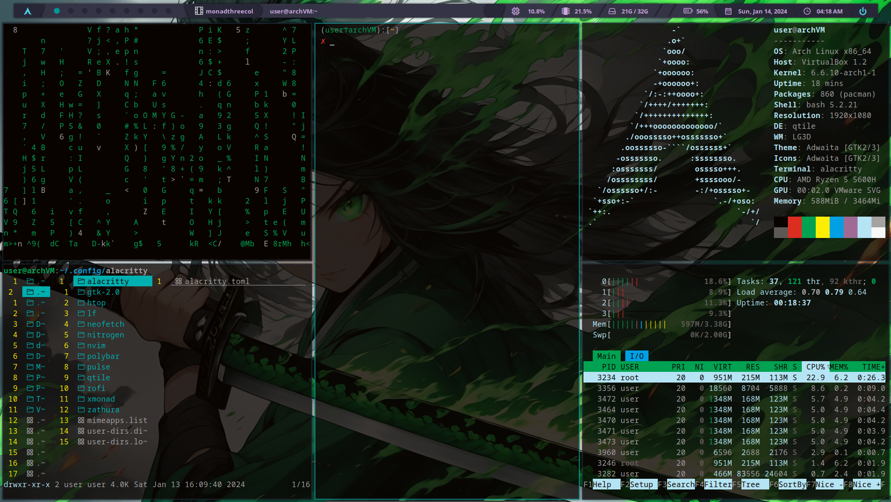
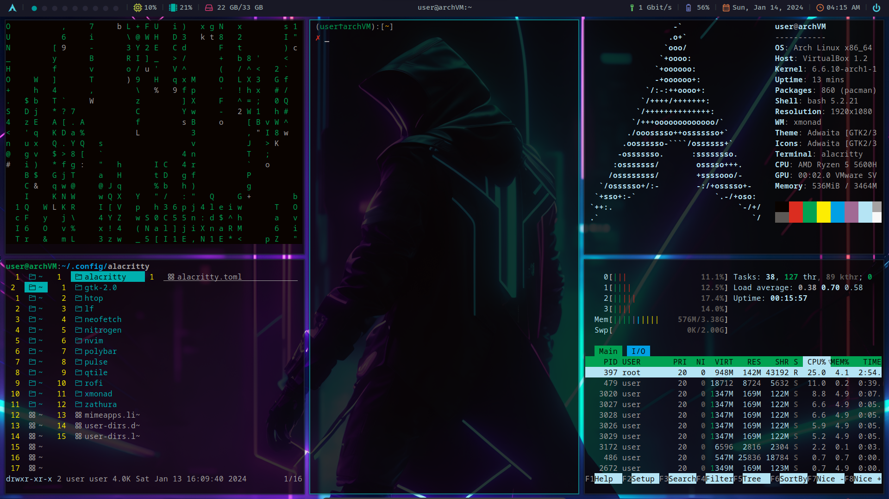
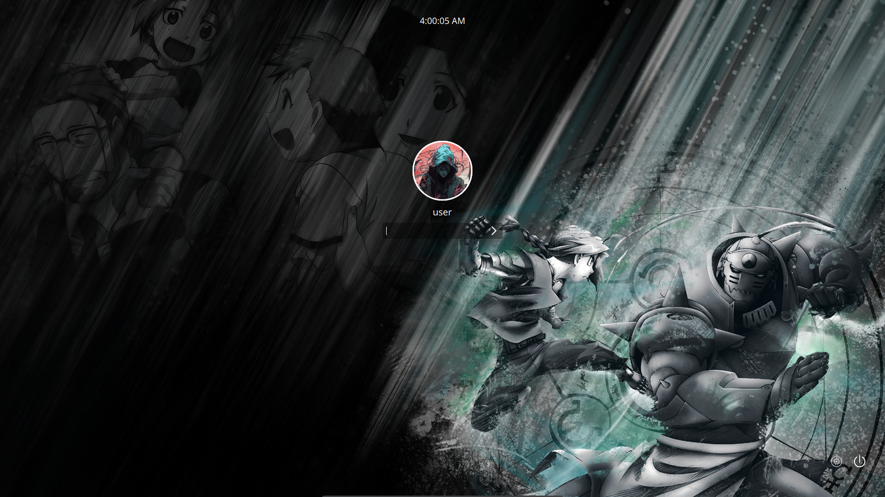

# Dotfiles
Config of Qtile and Xmonad window manager with :
- Alacritty (Terminal Emulator)
- Polybar (Status Bar)
- Nitrogen (Wallpaper Manager)
- Rofi (Window Switcher/Launcher)
- Picom (Compositor)
- Lf (File Manager)
- Neovim (Text Editor)

Qtile and Xmonad(polybar) are customized to behave analogously.
- Qtile

- Xmonad

- Sddm theme: https://github.com/shinas101/Anime-sddm-theme<br>

- Grub theme: https://github.com/voidlhf/StarRailGrubThemes


#### Setup on Arch
On Basic installed arch install git and run following to setup the configuration.
```bash
git clone https://github.com/YujanSubedi/dotfile
cd dotfile
./install.sh
```
Grub theme can be changed from grub-customizer or by changing /etc/default/grub.

### Startx
To run the from startx xorg-xinit package is needed
```bash
sudo pacman -S xorg-xinit
```
Add following to .xinitrc
- Qtile
```bash
#!/bin/bash
exec qtile start
```
- Qtile wayland
```bash
#!/bin/bash
exec qtile start -b wayland
```
- Xmonad
```bash
#!/bin/bash
exec xmonad
```
To make .xinitrc executable
```bash
chmod +x .xinitrc
```
To run it
```bash
startx
```
To Make auto run startx in tty1 after login, Add following to .bashrc or .bash_profile
```bash
[[ -z $DISPLAY && $XDG_VTNR -eq 1 ]] && exec startx
```

### for neovim config
```bash
git clone --depth 1 https://github.com/wbthomason/packer.nvim\
 ~/.local/share/nvim/site/pack/packer/start/packer.nvim
```
Open Neovim on ~/.config/nvim/lua/nvimprof and run :so to source and then :PackerSync to install package.
LSP requires unzip, tar and npm.

