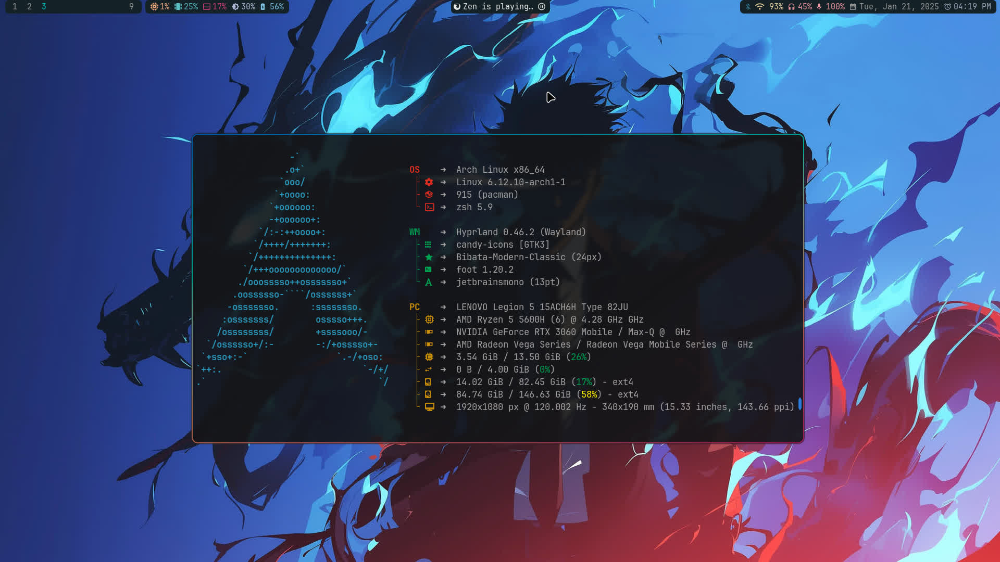

## Dotfiles

Contains config files of:

| Application       | Configurations                                                              |
| ----------------- | --------------------------------------------------------------------------- |
| Window Manager    | Niri, Hyprland, Xmoand, Qtile                                               |
| Compositor        | Niri, Hyprland, Picom                                                       |
| Teminal Emmulator | Foot, Simple Terminal(st), Urxvt, Ghostty, Alacritty, Kitty, Wezterm, Xterm |
| Shell             | Zsh, Bash                                                                   |
| Text Editor       | Neovim, Emacs, Zed                                                          |
| Status Bar        | Waybar, Polybar, Xmobar, Qtile builtin bar                                  |
| Launch Menu       | Rofi, Wofi                                                                  |
| Lock Screen       | Swaylock, Hyprlock, I3lock                                                  |
| Terminal tools    | Tmux, Bat, Fastfetch                                                        |
| File Manager      | Yazi, Lf                                                                    |
| Pdf Reader        | Zathura                                                                     |
| Image Viewer      | Vimiv                                                                       |
| Notification      | Dunst                                                                       |
| Browsers          | ZenBrowser, Firefox, QuteBrowser                                            |

-----
Used themes:

    Gtk-theme     Kali-Dark
    Icons-theme   Candy-Icons
    Mouse-theme   Bibata-Modern-Classic
-----

### Setup on Arch

``` bash
git clone --depth 1 https://github.com/YujanSubedi/dotfile
cd dotfile
./install.sh
```

-----

### Niri

Installation:

``` bash
sudo pacman -S --noconfirm --needed niri xwayland-satellite xdg-desktop-portal-gtk xdg-desktop-portal-gnome waybar foot swaybg swaylock
[ -d "$HOME/.config" ] || mkdir ~/.config/
cp -r ./configs/Window_Managers/niri ~/.config/
cp -r ./configs/Session_Lock/swaylock/ ~/.config/
cp -r ./configs/Terminal_Emulators/foot ~/.config/
cp -r ./configs/Application_Launchers/rofi ~/.config/
cp -r ./configs/Status_Bars/waybar ~/.config/
```


-----

### Hyprland

Installation:

``` bash
sudo pacman -S --noconfirm --needed hyprland rofi-wayland waybar hyprpaper foot
[ -d "$HOME/.config" ] || mkdir ~/.config/
cp -r ./configs/Window_Managers/hypr ~/.config/
cp -r ./configs/Terminal_Emulators/foot ~/.config/
cp -r ./configs/Application_Launchers/rofi ~/.config/
cp -r ./configs/Status_Bars/waybar ~/.config/
```



-----

### Qtile

Installation:

``` bash
sudo pacman -S --noconfirm --needed qtile python-psutil python-iwlib nitrogen picom rofi ghostty
[ -d "$HOME/.config" ] || mkdir ~/.config/
cp -r ./configs/Window_Managers/qtile ~/.config/
cp -r ./configs/Terminal_Emulators/ghostty ~/.config/
cp -r ./configs/Application_Launchers/rofi ~/.config/
```


-----

### Xmonad

Installation:

``` bash
sudo pacman -S --noconfirm --needed xmonad xmonad-contrib polybar picom nitrogen rofi ghostty
[ -d "$HOME/.config" ] || mkdir ~/.config/
cp -r ./configs/Window_Managers/xmonad ~/.config/
cp -r ./configs/Terminal_Emulators/ghostty ~/.config/
cp -r ./configs/Application_Launchers/rofi ~/.config/
cp -r ./configs/Status_Bars/polybar ~/.config/
```


-----

### Hyprlock

Installation:

``` bash
sudo pacman -S --noconfirm --needed hyprlock
[ -d "$HOME/.config" ] || mkdir -p ~/.config/hypr/
cp ./configs/Window_Managers/hypr/hyprlock.conf ~/.config/hypr/
[ -d "$HOME/Pictures/Lockscreen" ] || mkdir -p ~/Pictures/Lockscreen
cp ./Pictures/Lockscreen/lockscreen.jpg ~/Pictures/Lockscreen/
```


-----

- Synchronize time by NTP:

``` bash
 sudo timedatectl set-ntp true
```

-----

- Sudo requires password everytime:

``` bash
sudo visudo
# sudoedit /etc/sudoers
```

``` txt
Defaults timestamp_timeout=0
```

-----

- No login on tty1:

``` bash
sudo -E systemctl edit getty@tty1.service
```

``` txt
[Service]
ExecStart=
ExecStart=-/usr/bin/agetty --autologin <User_Name> --noclear %I "$TERM"
```

-----

- Autorun Window Manager on tt1:

``` bash
"$EDITOR" ~/.bash_profile
```

``` bash
# [[ -z "$DISPLAY" && "$XDG_VTNR" -eq 1 ]] && exec startx # For Xserver based WM, requires .xinitrc
# [[ -z "$DISPLAY" && "$XDG_VTNR" -eq 1 ]] && exec Hyprland # For Hyprland
# [[ -z "$DISPLAY" && "$XDG_VTNR" -eq 1 ]] && exec niri-session # For Niri
```

-----

- Power Handling:

``` bash
sudoedit /etc/systemd/logind.conf
```

-----

- Nvidia driver:

>Nvidia driver options

``` bash
sudoedit /etc/modprobe.d/nvidia.conf
```

``` txt
options nvidia_drm modeset=1 fbdev=1
```

>Kernal modules to load on startup

``` bash
sudoedit /etc/mkinitcpio.conf
```

``` txt
MODULES=(amdgpu nvidia nvidia_modeset nvidia_uvm nvidia_drm)
```

-----

- Use dash as sh

``` bash
sudo pacman -S --noconfirm --needed dash
sudo ln -sf /bin/dash /bin/sh
```

-----

- Use zsh as default shell

```bash
sudo pacman -S --noconfirm --needed zsh
chsh -s /bin/zsh
```

>by usermod

```bash
sudo usermod -s /bin/zsh $USER
```

>for new user

```bash
sudo useradd -MG wheel -s /bin/zsh <User_Name>
```

> see the change

```bash
getent passwd $USER
```

>find username and change /bin/bash to /bin/zsh at end of line.

``` bash
cat /etc/passwd
```

``` txt
[user_name]:[password_placeholder]:[user_id]:[group_id]:[user_info]:[home_direcotry]:bin/zsh
```

-----

- Use bash and zsh config

``` bash
[ -d "$HOME/.config" ] || mkdir ~/.config/
cp -r ./configs/Defaults/shell/ ~/.config/
ln -s ~/.config/shell/profile ~/.zprofile
ln -s ~/.config/shell/profile ~/.bash_profile
ln -s ~/.config/shell/barshrc ~/.bashrc
```

-----

Resources for wallpapers:

- [Alpha Coders](https://wall.alphacoders.com)
- [Wallpaper Flare](https://www.wallpaperflare.com/)
- [r/wallpapers](https://www.reddit.com/r/wallpapers/)
- [4K Wallpapers](https://4kwallpapers.com/)
- [wallhaven](https://wallhaven.cc/)

-----
