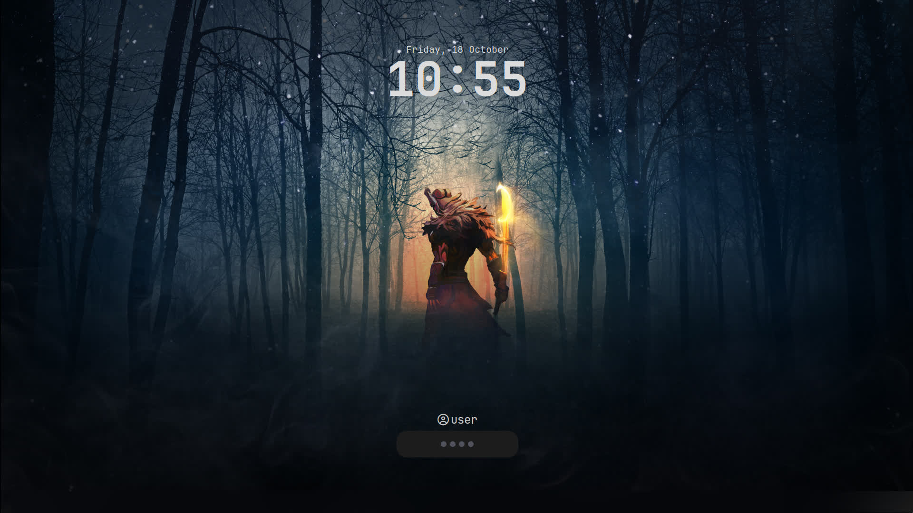

#+author: Yujan Subedi
#+options: toc:nil num:nil html-postamble:nil

** Dotfiles
Contains config files of:
| Window Manager    | Hyprland, Xmoand, Qtile                                            |
| Compositor        | Hyprland, Picom                                                    |
| Teminal Emmulator | Foot, Simple Terminal(st), Alacritty, Kitty, Wezterm, Urxvt, Xterm |
| Shell             | Zsh, Bash                                                          |
| Text Editor       | Neovim, Emacs, Zed                                                 |
| Status Bar        | Waybar, Polybar, Xmobar, Qtile builtin bar                         |
| Launch Menu       | Wofi, Rofi                                                         |
| Display Manager   | Lightdm, Sddm, Ly                                                  |
| Lock Screen       | Hyprlock, I3lock                                                   |
| Terminal tools    | Tmux, Bat, Fastfetch                                               |
| File Manager      | Yazi, Lf                                                           |
| Pdf Reader        | Zathura                                                            |
| Image Viewer      | Vimiv                                                              |
| Notification      | Dunst                                                              |
| Browsers          | ZenBrowser, Firefox, QuteBrowser                                   |

*** Setup on Arch
#+begin_src bash
  git clone https://github.com/YujanSubedi/dotfile
  cd dotfile
  ./install.sh
#+end_src

*** Hyprland
Installation:
#+begin_src bash
  sudo pacman -S --noconfirm --needed hyprland wofi waybar swww
  cp -r ./Window_managers/Hyprland/* ~/.config/
#+end_src
[[file:./Screenshots/Hyprland.jpg]]

*** Qtile
Installation:
#+begin_src bash
  sudo pacman -S --noconfirm --needed qtile python-psutil python-iwlib nitrogen picom rofi
  cp -r ./Window_managers/Qtile/* ~/.config/
  sudo cp ./old_files/suckless/st /bin/
#+end_src
[[file:./Screenshots/Qtile.jpg]]

*** Xmonad
Installation:
#+begin_src bash
  sudo pacman -S --noconfirm --needed xmonad xmonad-contrib polybar picom nitrogen rofi
  cp -r ./Window_managers/Xmonad/* ~/.config/
  sudo cp ./old_files/suckless/st /bin/
#+end_src
[[file:./Screenshots/Xmonad.jpg]]

*** Hyprlock
Installation:
#+begin_src bash
  sudo pacman -S --noconfirm --needed hyprlock
  cp -r ./Window_managers/Hyprland/hypr ~/.config/
  cp ./Pictures/Lockscreen/lockscreen.jpg ~/Pictures/lockscreen/
#+end_src

*** Grub
Installation:
#+begin_src bash
  sudo pacman -S --noconfirm --needed grub efibootmgr os-oprober
  sudo cp -r ./Grub/DanHeng/ /boot/grub/themes/
#+end_src
#+begin_src bash
  sudoedit /etc/default/grub
  # grub-customizer
#+end_src
#+begin_src text
  GRUB_CMDLINE_LINUX_DEFAULT=""
  GRUB_THEME="/boot/grub/themes/DanHeng/theme.txt"
  GRUB_DISABLE_OS_PROBER="false"
#+end_src
[[file:./Screenshots/Grub.jpg]]

**** Sudo requires password everytime:
#+begin_src text
  sudo visudo
  # sudoedit /etc/sudoers
#+end_src
#+begin_src text
  Defaults timestamp_timeout=0
#+end_src

**** No login on tty1:
#+begin_src bash
  sudo -E systemctl edit getty@tty1.service
#+end_src
#+begin_src text
  [Service]
  ExecStart=
  ExecStart=-/usr/bin/agetty --autologin <User_Name> --noclear %I $TERM
#+end_src

**** Autorun Window Manager on tt1:
#+begin_src bash
  $EDITOR ~/.bash_profile
#+end_src
#+begin_src bash
  # [[ -z $DISPLAY && $XDG_VTNR -eq 1 ]] && exec startx # For Xserver based WM, requires .xinitrc
  # [[ -z $DISPLAY && $XDG_VTNR -eq 1 ]] && exec Hyprland # For Hyprland
#+end_src

**** Power Handling:
#+begin_src bash
  sudoedit /etc/systemd/logind.conf
#+end_src

**** Nvidia driver:
Nvidia driver options
#+begin_src bash
  sudoedit /etc/modprobe.d/nvidia.conf
#+end_src
#+begin_src text
  options nvidia_drm modeset=1 fbdev=1
#+end_src

Kernal modules to load on startup
#+begin_src bash
  sudoedit /etc/mkinitcpio.conf
#+end_src
#+begin_src text
  MODULES=(amdgpu nvidia nvidia_modeset nvidia_uvm nvidia_drm)
#+end_src
