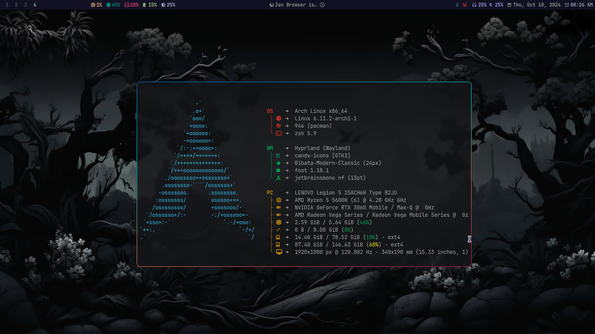
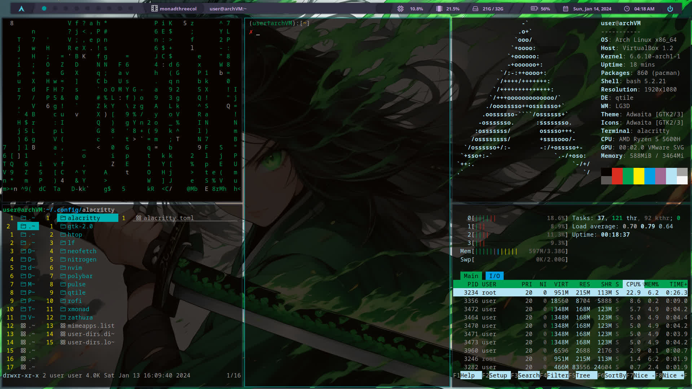
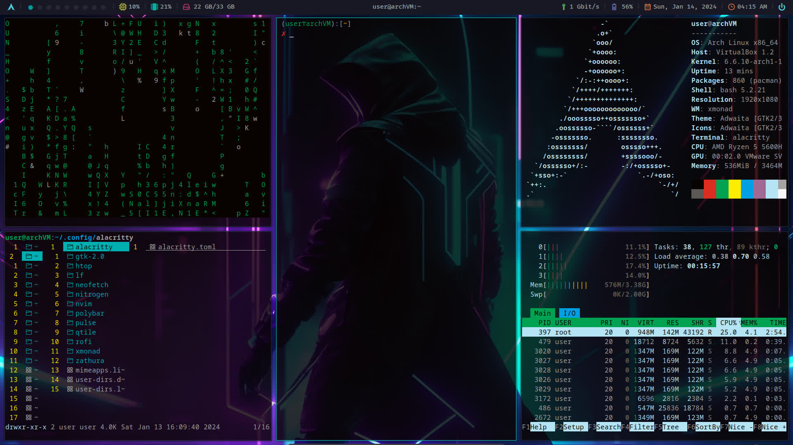
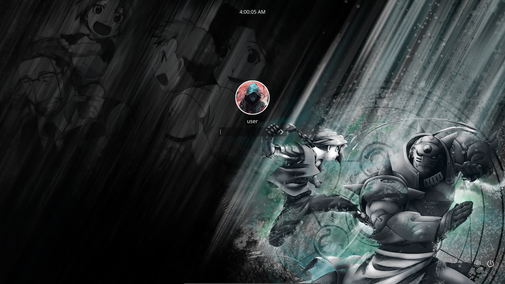

#+AUTHOR: Yujan Subedi
#+OPTIONS: toc:nil num:nil html-postamble:nil

** Dotfiles
Contains configs of:
    Window Manager:
    - Qtile
    - Xmonad (Polybar)
    - Hyprland (Waybar)
    Text Editor:
    - Neovim
    - Emacs
    Menu:
    - Rofi
    - Wofi
    Compositor:
    - Picom
    Display_manager:
    - Sddm
    - Lightdm
    - Ly
    File manager:
    - Lf
    Pdf Viewer:
    - Zathura
    Image Viewer:
    - Vimiv
    Terminal Emmulator:
    - Alacritty
    Terminal Tools:
    - Tmux
    - Fastfetch
    Shell:
    - Bash
    - Zsh

*** Hyprland
#+BEGIN_SRC bash
sudo pacman -S --nonconfirm hyprland wofi waybar swww
#+END_SRC

*** Qtile
#+BEGIN_SRC bash
sudo pacman -S --nonconfirm qtile python-psutil python-iwlib nitrogen picom rofi
#+END_SRC

*** Xmonad
#+BEGIN_SRC bash
sudo pacman -S --nonconfirm xmonad xmonad-contrib polybar picom nitrogen rofi
#+END_SRC

*** Sddm
#+BEGIN_SRC bash
sudo pacman -S --nonconfirm sddm
#+END_SRC

*** Grub
#+BEGIN_SRC bash
sudo pacman -S --nonconfirm grub efibootmgr os-oprober
#+END_SRC

*** Setup on Arch
#+begin_src bash
git clone https://github.com/YujanSubedi/dotfile
cd dotfile
./install.sh
#+end_src

**** Sudo require password everytime: /etc/sudoers
#+begin_src text
Defaults timestamp_timeout=0
#+end_src

**** No login on tty1: "sudo systemctl edit getty@tty1.service"
#+begin_src text
[Service]
ExecStart=
ExecStart=-/usr/bin/agetty --autologin <User_Name> --noclear %I $TERM
#+end_src

**** Autorun Window Manager on tt1: ~/.bash_profile
#+begin_src bash
[[ -z $DISPLAY && $XDG_VTNR -eq 1 ]] && exec startx # For Xserver based WM, requires .xinitrc
#+end_src
#+begin_src bash
[[ -z $DISPLAY && $XDG_VTNR -eq 1 ]] && exec Hyprland # For Hyprland
#+end_src

**** Handling Power buttom: /etc/systemd/logind.conf

**** Grub theme: /etc/default/grub
#+begin_src text
GRUB_THEME="/boot/grub/themes/DanHeng/theme.txt"
#+end_src

**** Nvidia driver:
/etc/modprobe.d/nvidia.conf
#+begin_src text
options nvidia_drm modeset=1 fbdev=1
options nvidia "NVreg_UsePageAttributeTable=1"
options nvidia "NVreg_PreserveVideoMemoryAllocations=1"
options nvidia "NVreg_TemporaryFilePath=/var/tmp"
options nvidia "NVreg_EnableS0ixPowerManagement=1"
#+end_src
/etc/mkinitcpio.conf
#+begin_src text
MODULES=(amdgpu nvidia nvidia_modeset nvidia_uvm nvidia_drm)
#+end_src
